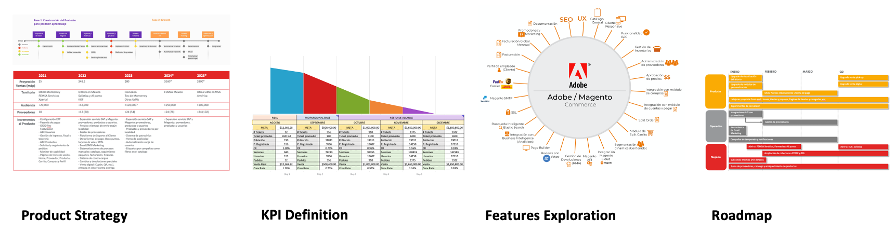
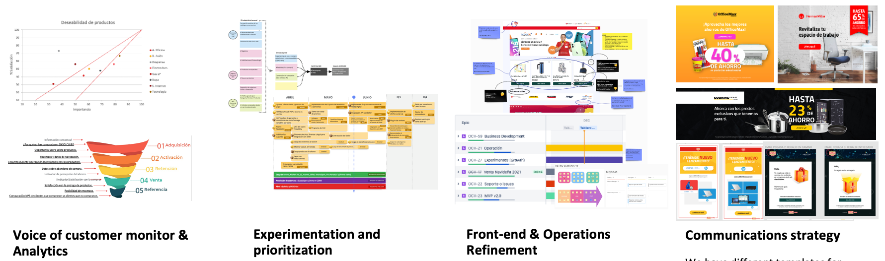
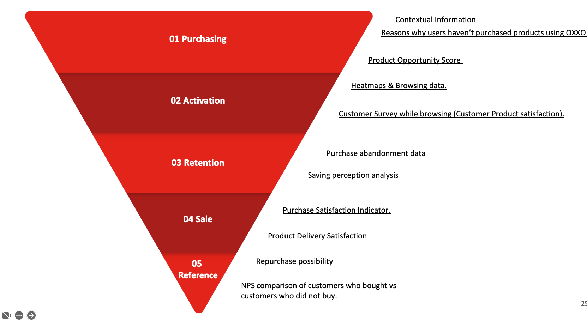
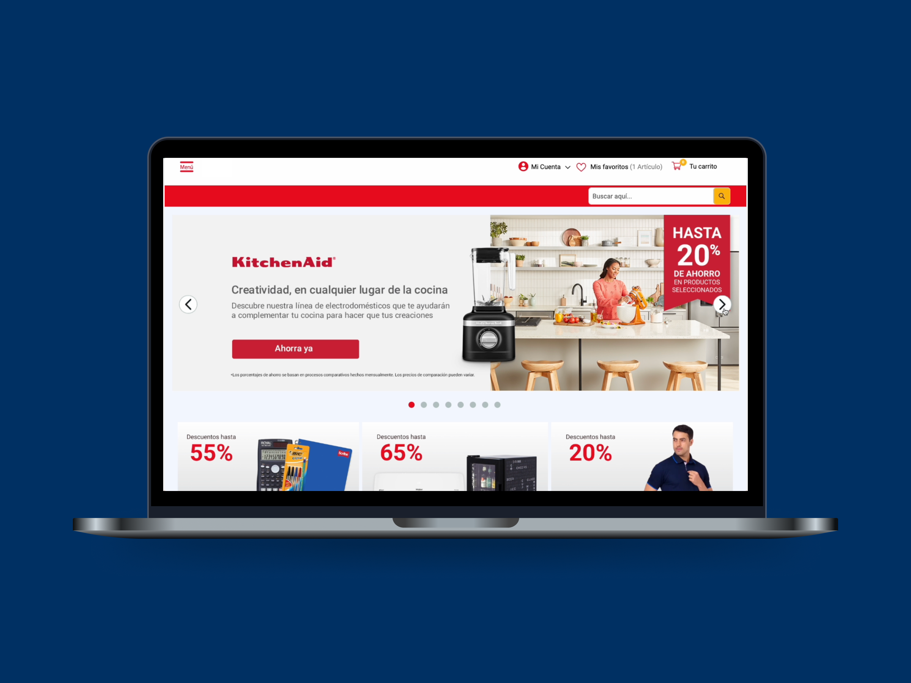

## Context

**I worked for the Digital Transformation department** in the Innovation Lab team as their first Product Manager for consultancy projects where I was assigned by percentages to different business units but also to internal initiatives aligned with the corporate's goals.

**The team of Procurement solutions** had an initiative to enable a digital platform to offer a catalog of products they dealt with big discounts from corporate's suppliers. After they ran a non-digital pilot with some employees, they got budget assigned from HR of the biggest business unit with **two goals: grow to be self-sustaining and produce as much savings as possible for employees.** **This was not profit-driven.**

They planned to release this **e-commerce platform** to offer those products as a **Price club marketplace**, under the **drop-shipping** model while being able to scale to more vendors and users from other business units so they could charge them for the **access to this employee benefit**.

## Challenge

**This was the first digital product they had built.** They were not technical nor experienced with e-commerce. So, **they thought on investing in a robust platform** to support future growth, fully customize the front-end and ensure they'll meet any security future concern from corporate.

**The initiative had 4 teams, 17 people**: Operations, Commercial, Marketing and Customer experience. Besides, an agency as (2) 3rd party developers. And, the cost of operation was estimated above US$200K.

I was assigned to help them **refine their CX strategy and reorganize their product** development stage so they could meet the intended value proposition while **people in operations learned how to product manage** a digital solution.

**Moreover, after the product release,** we faced some problems with the **business plan and the platform** (Adobe Magento) which was very robust but expensive to customize. For example:

- Having different shopping carts for every vendor's store, in the checkout.
- Handling manually all the weekly purchases to the vendors, customers feedback and notifications.
- Big delivery times, weeks–months for certain products.
- The most attractive discounts (35%) only for bulk purchases or premium items.

## Solution

We needed a clear strategy and roadmap. We needed product rituals and artifacts. **Product culture was key to put vision down to earth and deliver on time** the value proposition: A center for benefits and savings in products, then grow for self-sustaining but not for profit.

After trying different tools, I created **a master–PowerPoint–deck**. This was updated every month. **The vision and year's goals**, the last month sales results, a **high level strategic roadmap**, and one slide per team with their timeline.

**Once the roadmap and all team's timelines were clear and aligned, priority stood out** and we could release the most essential features for the basic user journey. We leaved the rest for a next version which had to be–user–validated.

In December 2021, we release the version 1 (aka. MVP) with 7 (epic) features:

- Home page with slider of current campaign
- Category pages (i.e. Office supplies, Kitchen accessories, Tools, etc.)
- Catalog dynamic page with Filters and Search
- Product page with details
- Shopping cart and checkout
- Analytics of use and sales
- Backend reports for products, users, orders, and vendors.

After the release pressure, we **defined our product metrics to monitor**, then Operations team started a **weekly results review** every Monday – **Sales, savings, registered users, logins, average ticket, conversion**, etc.

**We re-mapped the user journey** starting from the log in/sign in process to the payment, we did usability tests with 12 users. And, we found +48 friction points to improve.

Then **we reviewed existing alternatives for the layouts, interactions and user flows**, benchmarking 11 e-commerce our users liked: Walmart, Elektra, Coppel, Cooking Depot, Mercado Libre, Amazon, Shein, Office Max, HEB, Soriana, Grainger.

During 2022, we achieved **released several features based on our findings**:

- Home page with banners, stores top products carousels
- Store pages with categories and situations carousels
- Emails with dynamic links to filtered product lists
- Product card with savings displayed
- Product page with savings and store comparison and personalization controls
- Shopping cart with savings displayed
- Checkout process with more payment options
- Backend for automate invoices, delivery tracking, and orders with vendors.

We **pushed to ran continuos research as part of every sprint** so we could monitor our funnel of 5 stages.

Besides, **we inserted quick-surveys pop-ups at strategic moments** inside the app to capture customer's feedback at:

- Sign in & Log in
- Home, Search & Product selection
- Payment process
- Confirmation & Waiting for order
- Receiving order
- Use & Feedback

**These are some actionable insights:**

- We learned some **banners with the discount** in % instead of $ were more effective, or images of top products instead of brand's logos were more clicked.
- In the pages, we detected users clicks trace and search was situational after seeing a product. So we redesigned the information architecture to show **products for situations** (Wash the car) **inside a category** (Cleaning products). This doubled conversion of those items. –We didn't have bundles at that point. We developed those later.
- We detected people valued **physical information** from the item like a review with pictures, or product images with dimensions in real environments. So we promoted these new features in the roadmap.
- Displaying **products by _store pages_**, solved the technical constrain of the shopping carts separated by vendor in the checkout. People were aware from the beginning that they buying in different places, _like at the mall_.

## Outcome

By July 2023, we reached **30 vendors**, 2.5k products, **16k registered users**, 190k monthly visits, **0.4–3% monthly conversion rate**, **US$160k+ sales**, average ticket of US$200 and **average savings of 30%**. Besides a catalog with 400+ discount benefits in physical stores.

About customers satisfaction, 3 out of 4 customers (75%) considered this e-commerce **_helped them saving money when they need to buy something special_**. This was reflected as **41 pts in NPS**, which is above **the average NPS of e-commerce brands in 2021 was 37 points,** according to [_Survicate_](https://survicate.com/nps-benchmarks/?ref=antonioavalos.com).

Since this was considered a success, **the team got budget for 2 spin-off products** to release in 2023 Q4: an internal B2B platform with office supplies items, and a rebranded platform with a niche-curated offer. But, I was only involved as **consultant of the team's budget and MVP roadmap strategy**, not in the release plan or operations.

## Lessons learned

🧑‍🏫

I had to re-educate this team on product strategy instead of filling design canvas/templates and then paying for a SaaS implementation which is the _modus operandi_ of big corporations and operative teams.

🙅‍♂️

"Saying No" to stakeholders. Explaining what to focus on based on data, and why adding features compromises the vision, experience and operation was part of every roadmap review, which they thanked me.

📈

I experienced organic growth tactics. From feedback surveys, analytics tools, customer interviews, usability tests and market trends to nurture persuasive banners, pages and meaningful email campaigns.
–You can read some anecdotes at the end of the _Solution_ story.

⚖️

Even we barely accomplished to cover operational costs with income. The team had to continue the path of reduce complexity and invest on marketing to bring more customers. The traditional business path. But they have a potential user base of 354K employees and had only registered 16k users with a conversion rate of 0.4–3%. So, I'm sure it's a matter of time they'll make profit to invest on more benefits for employees.

🙏

Operating a whole e-commerce is hard as any business. I led and learned every day from talented people on: Finance, legal, fulfillment, customer service, brand, marketing, technical operations, user experience, development, digital security, people management, etc.
