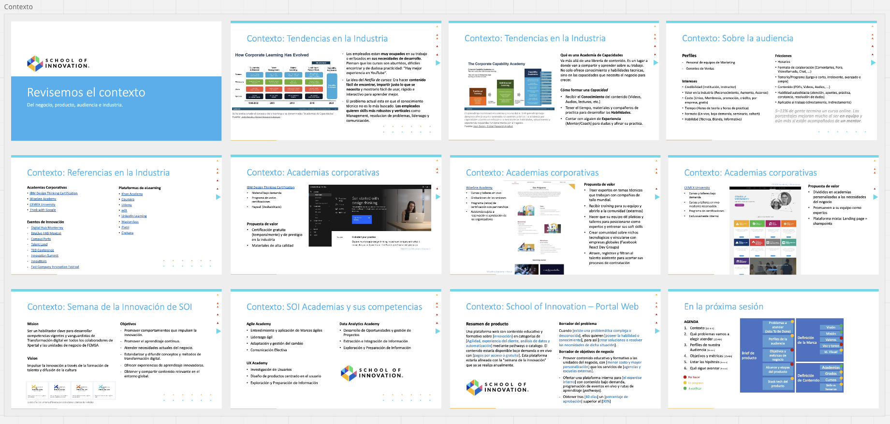
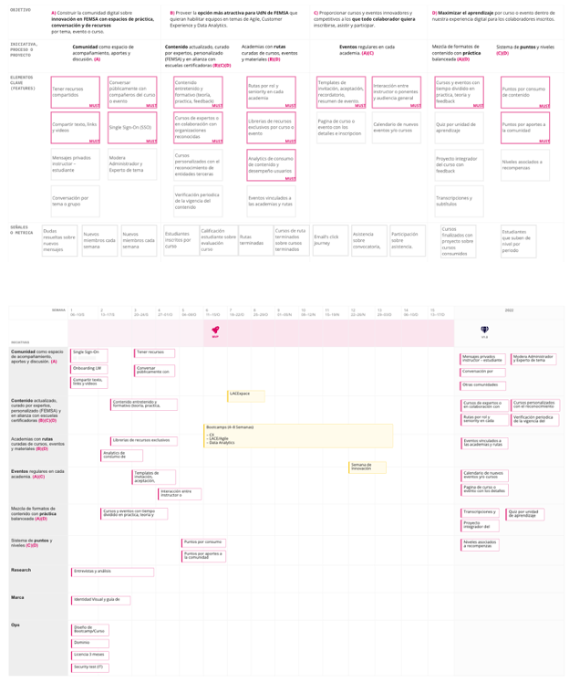
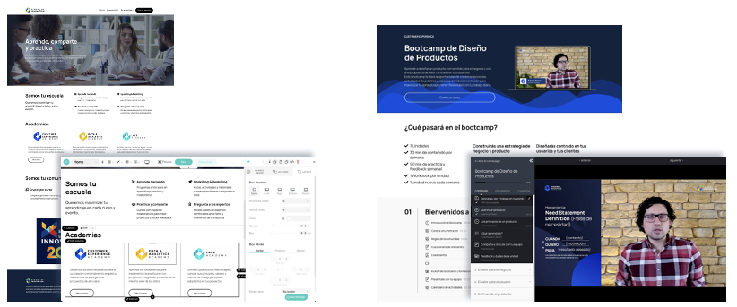
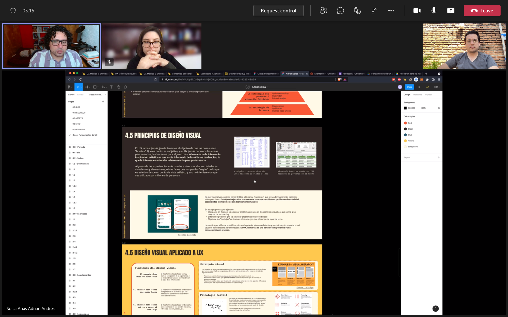
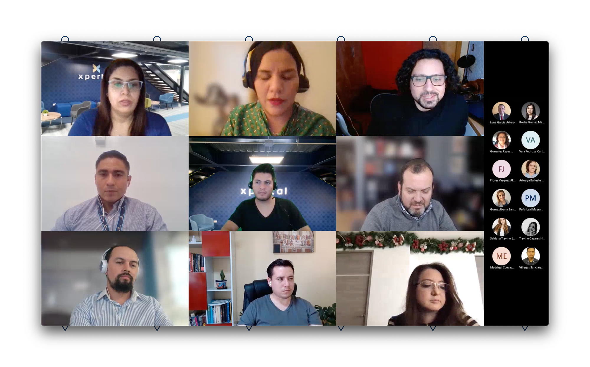
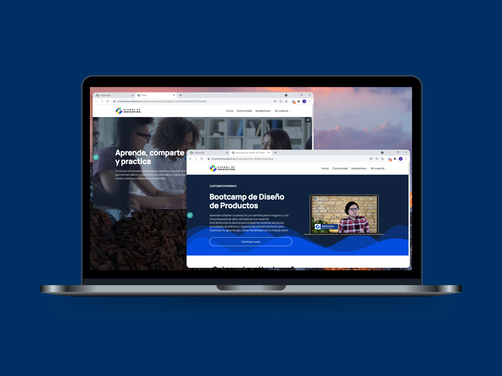

## Context

**I worked for the Digital Transformation department** in the Innovation Lab team as their first Product Manager for consultancy projects where I was assigned by percentages to different business units but also to internal initiatives aligned with the corporate's goals.

In September 2021, my manager's manager proposed an initiative to **create an online school**, for the different businesses in the corporation, that we could run with courses from the experienced members of our Innovation team.

## Challenge

A small team of a Visual designer, the Education leader, and me as the Product Manager had **the goal to release a platform and a new product design course** by December –**3 months**.

This product had to **compete with online top education** like [IDEO](https://www.google.com/aclk?sa=l&ai=DChcSEwiP_4esw7qEAxW7h8IIHePWC7kYABABGgJqZg&ase=2&gclid=CjwKCAiAuNGuBhAkEiwAGId4apnZKqvOjILQvBSDPAZFaZVLLKN3Q-Yke8j2K_MQcmL1uTB98CFhyRoC0LoQAvD_BwE&sig=AOD64_01wCz5yzmDEcVD8fOLx5-hN5roLw&q=&nis=4&adurl=&ved=2ahUKEwi8kYKsw7qEAxUGBEQIHS7yDvMQ0Qx6BAgHEAE&ref=antonioavalos.com), [IxDF](https://www.interaction-design.org/?ref=antonioavalos.com) or [Kurios](https://www.kurios.la/?ref=antonioavalos.com) because teams normally spend their education budgets on those. It had to **offer high-quality** learning materials and an education program to keep growing the courses in 3 areas: **Customer Experience, Agile Methodologies, and Data Analytics**, besides **hosting an online community** to keep people interested and updated with courses.

## Solution

I did some desktop **research on the ed-tech** industry and our main competitors before I ran a series of **workshops with our department's managers** to get the **vision, and goals we wanted to pursue**.

Later, I **interviewed 8 potential users** to uncover their context and needs. So, I co-created with the team **the value proposition we expected to build** and worked on a Product proposal brief to get the managers' approval and budget assigned to this initiative.

- **This had to serve 2 profiles:**
  - The student (user) and The boss (customer)
- **Their pain points were:**
  - They lose time with low quality or outdated internal training
  - They spend outrageous money to access content from foreign experts
  - They don't have much time or continuos motivation to study
  - They don't have a route or guide to follow what they need to learn
- **So, we offered:**
  - Courses updated, curtated and produced with the top experts available in our teams.
  - A learning formula: _Learn self-paced, share with the community, and practice with expert feedback._
  - Different academies with routes of courses according to skills business units were looking for or needed to improve.
  - A community as a multimedia space to discuss and enrich from other people experiences.
  - A sistem of point and levels, as gamification first stage.
  - Recurrent events to get noticed for more teams and business units

Based on the Product proposal brief, **I created a Product roadmap** so I could start benchmarking providers and agencies to compare options to build our product. **Agencies were so expensive for our MVP** needs (>US$50K) so **I interviewed 5 Learning Management System**s (LMS) providers to find the best fit for our strategy.

I selected [LearnWorlds](https://www.learnworlds.com/?ref=antonioavalos.com) so we could spend an affordable (US$249) monthly price, while we worked on the content and bureaucracy.

**The features that matched our priority were:**

- School, academy, and course landing pages
- Student home page with their open courses and progress
- Teacher home page with recent messages or interactions
- Multimedia player for course materials
- Quizzes, exams, and projects to evaluate students
- Analytics of use
- Custom domain and site white label

And some from our next version:

- A community site with groups and messages
- Interactive player for custom video interactions
- Certificate generator (To avoid operational work)
- Capacity for multiple languages (In case English or Portuguese were needed)
- SSO for login (In case business units expressed access concerns)

In the following weeks, the team worked on the **new brand for the school**, the **platform customization**, the **first course production**, strategy meetings about **the education style**, and dealing with **IT Security and Legal teams** that were not familiar with MVPs or experiments.

**Based on the learning process I researched**: _Learn self-paced, share with the community, and practice with expert feedback_; **I directed the first course** of someone whose work in the UX Community I deeply admire: [Adrian Solca](https://www.linkedin.com/in/adriansolca?miniProfileUrn=urn%3Ali%3Afs_miniProfile%3AACoAAATzy0MBbCrMGAGad3BHFcbynVdm7KtU-Y4&lipi=urn%3Ali%3Apage%3Ad_flagship3_search_srp_all%3Bb8dL8MpuQ5OQ1hFkTRJHKQ%3D%3D&ref=antonioavalos.com).

I discussed with him the goal and topics of the course. So he could prepare the course materials and record himself for the video classes. Later, the visual designer created the final polished materials for the students and **I uploaded everything to the platform and prepared the quizzes** or exams for each unit.

The course had 6 units, one every week. We had to produce the materials 2 weeks in advance until we finished all the content. Every week we hosted a 1-2 hour call with Adrian so they could discuss the materials or have a review.

By the end of the 6 weeks, the 17 students had a project in teams where they pitched the products they had designed. **I created a scorecard and invited some judges from real positions in the company** so the students could receive real feedback from people who evaluate MVPs, initiatives, and budgets every day.

## Outcome

**We launched the MVP and hosted the first cohort** of a Product Design Bootcamp (6 weeks program) which **certified 17 people** from operations roles who were facing new digital projects at their jobs.

So December 2021 closed with **2 bootcamps**, **53 active students** with **146 hours of study** (tracked in the platform), **43 video classes** (6 hours), 168+ community posts, and **17 people got a certification** of completion.

The **education leader was promoted to manager and could hire 2 members** on her team to get an independent budget and freedom to expand this model to more courses, academies, and custom events.

In 2022, it got **5 academies with 1–4 courses** each, **2007 students mostly from 2 business units, and 850 participants in events.** It received an **NPS of 85%** and sold 10,000 spots for the upcoming 2023 in a customized product version.

We received **US$350–700 per student/course access and at least US$100K in passive income** for giving access to the community.

By 2023, our school had **reached 13 courses** (+**5 in a Portuguese** version) with **14,497 paid courses access** (15% of students completed at least a course) from 6 business units, **2400 students** as part of the online community, and 1200 participated in that year's events.

## Lessons learned

🧑‍🏫

Online courses are more than videos and PDFs. An education methodology, course direction, and professional post-production are essential to stand out in this market.

🤑

Even old businesses prefer long hours of synchronised sessions to get diplomas from prestigious institutions, education inside corporations is a very lucrative business with passive income and low customization efforts to keep selling training and workshops.

🧭

Higher management needs a clear vision and long-term goals for their schools, besides providing management coaching to the school staff. Otherwise, the school will stagnate into a Netflix of courses instead of becoming the space to upscale expensive skills on the market, challenge the company status quo, and nurture upcoming leaders.
