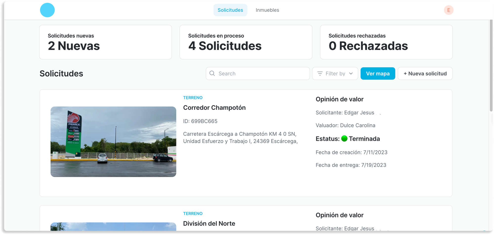
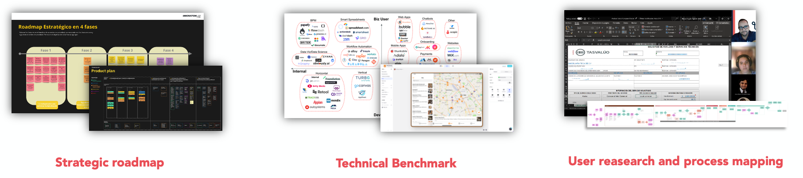
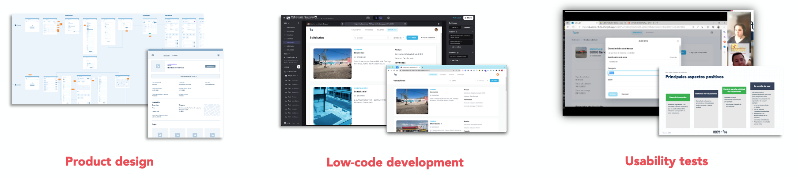
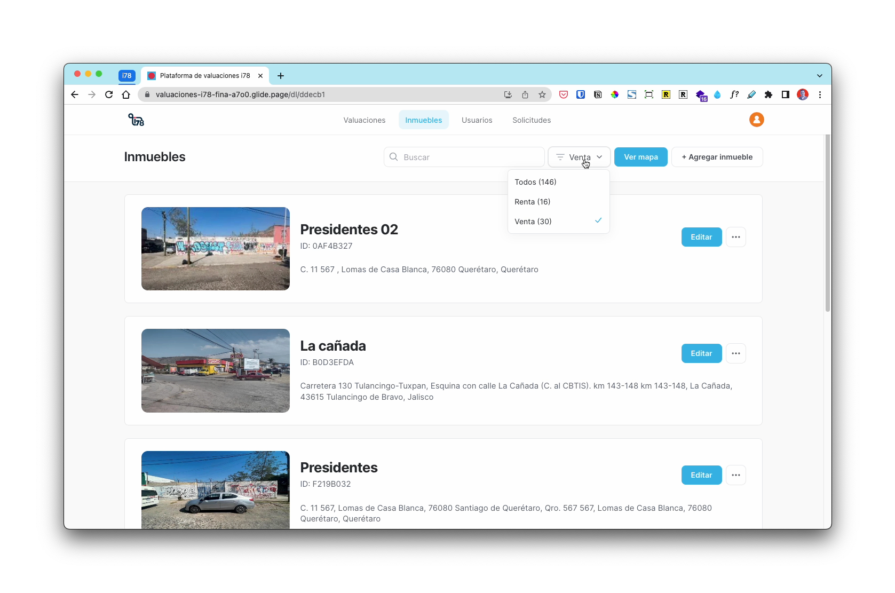
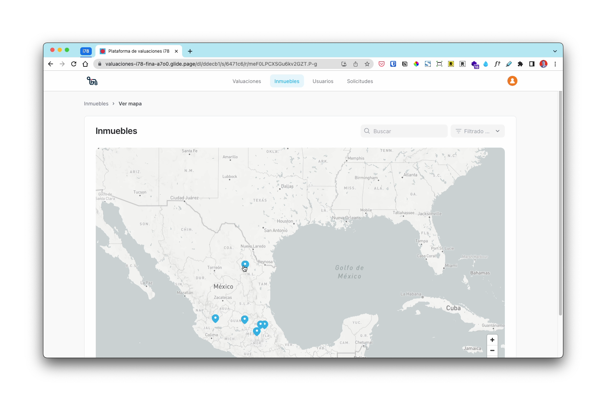
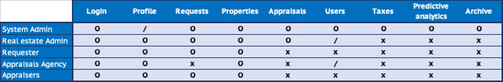
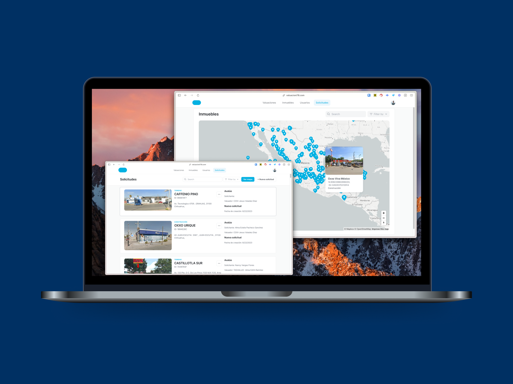

## Context

****I worked for the Digital Transformation department**** in the Innovation Lab team as their first Product Manager for consultancy projects where I was assigned by percentages to different business units but also to internal initiatives aligned with the corporate's goals.

****The real estate team in the retail business unit**** had their operations in paper and physical storage, using MS Office, MS Outlook and WhatsApp for control and communication. They ****receive requests from business units to value properties**** so they could evaluate buying or renting and build a store. 

****They saw potential in all the data stored from years****, plus the information going on during operational tasks so they could __run an algorithm__ and predict square meter's value per zone. ****It could reduce at least half operational tasks and costs, besides maximizing assets value**** knowing where to buy, rent, or sublease.

## Challenge

In a couple of weeks, I designed a proposal for the team so they could get buy in from higher management. This took longer than expected, they had never built or operate a digital platform nor product. Moreover, ****they expected a waterfall full product development.**** So, MVP, Agile, UX Design and User research were not as valued as "__micro-managed code time"__.

We got 3 objectives from the business:

****1.**** Optimize and streamline both the subprocesses within the real estate ****valuation process by appraisers****, as well as the ****document management**** of appraisals.  
****2.**** Have a structured ****digital archive**** of the historical appraisals conducted.  
****3.**** Provide decision-making intelligence in real estate valuation through the ****analysis of gathered data using machine learning (ML)****.

****Besides the MVP Product management, I also managed the project budget****: eventually up to US$350k. So I arranged a (non-full-time) Agile team of 1 Data scientist, 1 Data engineer, 2 Data Interns, 2 Product Designer, 2 UX Researchers, and 1 Visual Designer, from our Department. I also interview 6 agencies and ****hired a Low-Code agency**** to handle the development, but they worked in Waterfall, which complicated our timeframes.

## Solution

I worked with the stakeholders and agreed on ****4 releases****. Those were planned ****according to the 3 business goals**** but as product milestones:

- ****Alpha:**** Appraisal system manager for new requests, current appraisals, and appraisers data.
- ****Beta:**** Digital archive from 5 years of appraisals
- ****Gamma:**** Platform open to appraisers to generate their docs
- ****Delta:**** Predictive analysis tool with archive and operational data

After the kick-off, to keep deadlines, we ****had to work on 4 simultaneous initiatives****:

1. ****Create the web platform**** with the correct user experience. – Alpha/Gamma front-end features.
2. ****Digitalize 5 years of PDFs**** appraisals archive. – Beta data update.
3. ****Develop the ML predictive model****. – Connected to Delta release.
4. Comply IT Security company regulations and get approval from Legal Department to handle users data.

We started in October and ****Alfa was release in December**** 2022 (3-months), Beta in February 2023, Gamma in July, and Delta by August.

[__Jump to the Outcome of this project__](./#outcome) or continue reading about the releases.

---
### Alpha – Appraisals management

This was a big research effort. After interviews, we ****mapped all appraisal's subprocesses**** to outline platform ****navigation flows, functionalities, and interactions****.

In parallel, I evaluated our technical possibilities considering ****business needs****, the type of ****information****, and user ****context****. So, I researched and ****tested various Low-code technologies**** to reduce technical effort and time to market. So I interviewed 6 agencies and hired a [Glide Expert Agency: LowCode](https://www.lowcode.agency/).

We created a prototype design to test the concept with users and then redesign the scope of features, interface, and interactions.

To match with the waterfall style of the Low-code agency, I used a design–develop by user flows, so progressively we enabled usability tests: Requesters, Appraisers, Real Estate Admin, and the System Admin.

****In the second week of December,**** we invited a dozen appraisers and requesters to ****test the platform**** for their main tasks and evaluate the experience. We received ****ratings around 4/5**** for Ease, Reliability, and Platform Understanding. We released these validated features:

- Appraisal requests manager
- Digital appraisals with 40/400 fields – Perfect for informal valuations
- Properties collection
- Appraisers directory
- Users management and visibility permissions
- Publish 100 appraisals from the progress on the digital archive
- Maps with coordinates and images

We filed a request to generate a "Terms and conditions" document with the Legal Dept. Besides, we asked for guidance and verifications from the IT Security Org. Both took 5+ months to get the approvals.

### The Beta update – Loading a 5 years archive

We used Azure Cognitive Services to recognize content in the 3 PDF formats we received, then Map those fields into tables to export to a Database. Later, those were standardized (cleaned) and passed by manual revision of the most important data (400+ fields).

This was a ****4 month effort**** (February release) to nurture the initial database with ****2000 appraisals**** from 5 states basically. Even ****these were not really used by the team****, they were vital for giving ****structure to the database**** and to ****nurture the predictive model**** in the following months.

### Gamma release – A more robust back-end

Alfa version was way ****more successful than expected****. It even ****broke the database**** twice. So this released was ****replanned to robust our back-end**** features.

(3 imgs)

We moved from Secured Spreadsheets in our Sharepoint to native "Glide Big Table" to get ****better performance, operations robustness**** and simplifying "Actions" to ****less complex automations**** or custom code.

We ****introduced a new user type: Appraisals agencies.**** And, ****enabled 3 new sections****: Taxes, Predictive analytics, and Archive. So, the Alfa release had the Beta update with all the 2000 appraisals from the archive, now at July 2023 we ****offered 7 sections for 5 type of users:****

****This fully changed users' dynamic.**** Now ****Agencies could manage their Appraisers and handle their workload****, reducing work for the Real estate Administrators and ****justifying the charge for use (next year)**** for agencies to use the system for their own appraisals, properties and users.

(4 imgs)

And we changed from 1 System Admin to several more to control Taxes (****Invoices and payments were ahead next year****) and Predictive analytics (****Selling access to this section was planned in the next 2 years****).

### At the end, Delta released the last section:

****This was a 6-month development.**** After some changes from the initial infrastructure, it worked with: ****Azure Processing**** (Cognitive Services + Databricks), Storage account, Integration (Data factory) so it could connect to the native tables of our Low-code platform (****Glide****) as front-end, showing maps with ****Mapbox API**** and graphs from ****MS Power BI****.

(2 imgs)

It offered different types of predictive analysis: By ****key indicators****. Price per square meter and types of surroundings. Besides, ****Simulations**** for: Rent vs. Buy, Appreciation projection, and automatic valuation.

## Outcome

Today, the ****process was reduced from 2–5 days to 1–3 days.**** And the Real state ****team won't need anymore to outsource communication**** between valuation requests. Appraisal agencies and independents now ****spend less than 16 min instead of a couple of hours**** to fill and create a PDF appraisal.

In August 2023, we registered that ****everyday 15 new requests were registered**** on average, since the release in December 2022. ****We reached 3.7k+ properties from 610+ appraisals by 1100 registered users.****

The system will keep all the valued properties data, plus it has ****preloaded +2000 appraisals of all properties valued since 2017****.

And, the ML predictive model transform all data into ****tables, graphs and interactive maps**** with zoom and heatmaps, to display ****27 Relevant indicators**** by zone or environment, and a Rent vs Buy calculator with ****15 values prediction****.

Even these are not accurate, yet. ****It'll take around 1–2 years of operations to gather enough data to generate national predictions valid for commercial purposes.**** Or buying appraisals records from other companies –Which was under consideration.

And ****this platform opened doors to new income**** from appraisers and agencies to use the system to manage files, besides nurturing the real product to sell: properties value predictions and zone's value estimation.

## Lessons learned

💸

Even I normally created business–solutions–proposals and track design budget, this product’s budget was entirely managed from idea to support by me. This meant in-and-out of people, re-prioritize features, an agency payments and software licenses. All while dealing with business stakeholders and corporate departments of IT Security and Legal. 

🏗️

Using Low-code tools was a cheaper and faster option to focus on customer journeys and test in record time. Technical constraints helped us reducing possibilities and stay focused on value.

🛠️

Support, maintenance, enhancements, and people operations are usually forgotten in product strategy. Those are going to be the day-to-day or the life-saver on a bad day so it’s as important as any technical debt or business constraint.

🦺

Product teams need more awareness of the risks and standards of IT Security and Legal terms and conditions. Those have to be considered as a priority after validation. In this project, I had to push hard on corporate's teams and Low-code tools providers.

🧩

Breaking “the MVP” into releases was a key movement since the Product Startegy with all the Stakeholders as part of it. It was new to the team, but making them part of a transparent communication allowed us to enable parallel development work, test design, track adoption and refine our backlog several times.

---
